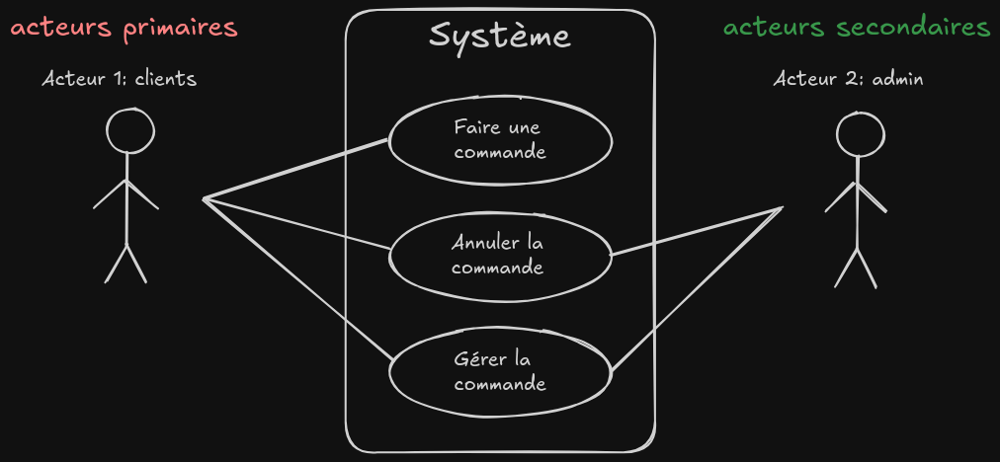

# projet d'analyse et conception d'applications
choisir : 
- netbeans 6.1 (<6.8)
- eclipse 3.4 (mieux que netbeans)
- visual paragdim community

ArgotUml\
uml designer

## use case diagram (diagramme de cas d'utilisations)
les fonctions doivent être écrient du pdv de l'acteur (avec des cercles) \
use case = cas d'utilisations, ex: acteur utilise une fct° \
max 8/9 cas d'utilisations\
acteur doit obligatoirement interagir avec au moins 1 fonction\
